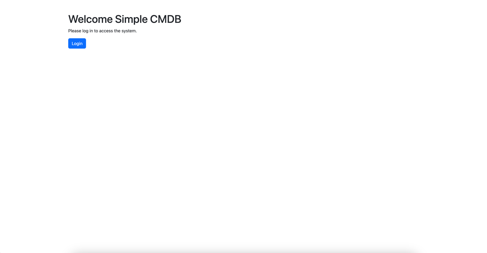
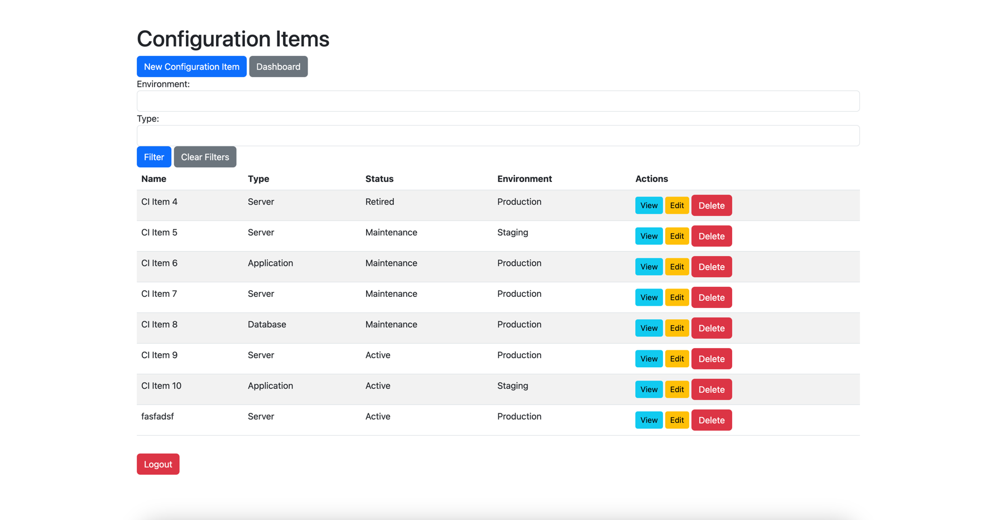
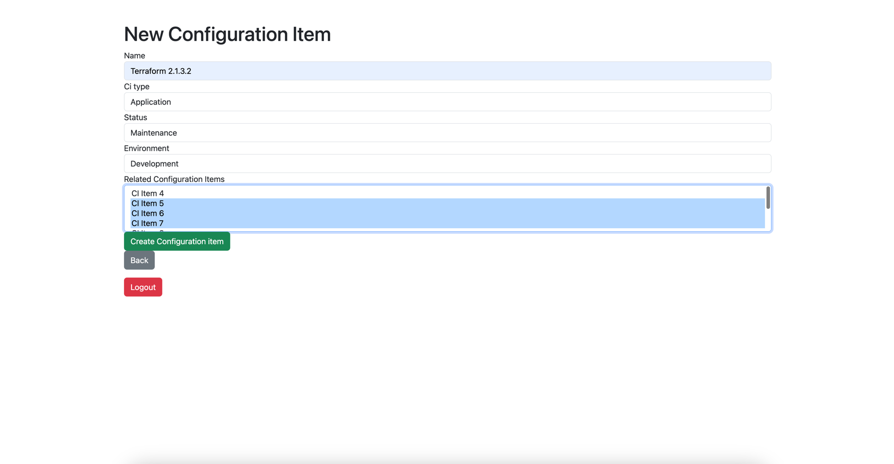
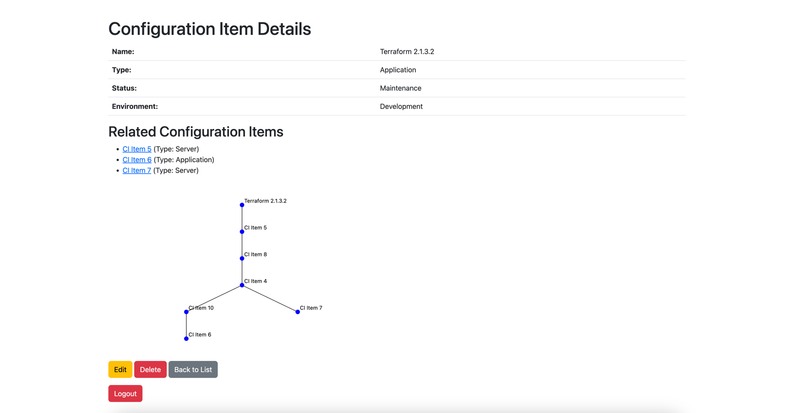
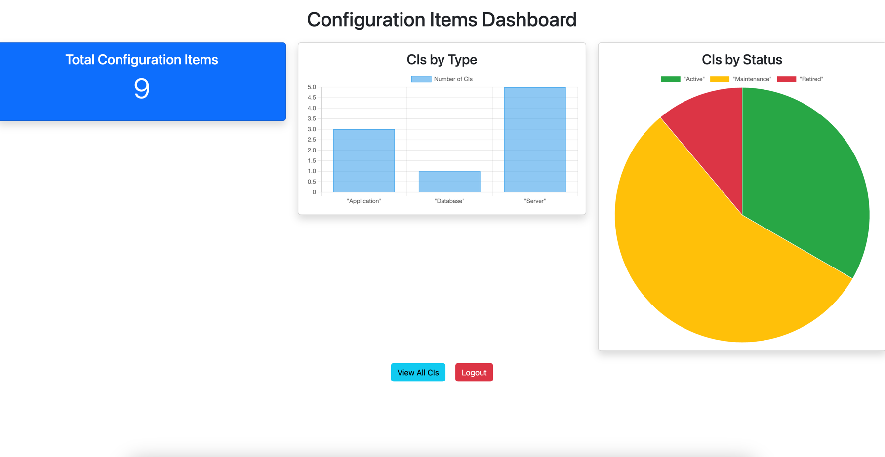

# README

# Simple CMDB

Simple CMDB is a Configuration Management Database (CMDB) system built with Ruby on Rails. It allows users to manage and track configuration items.

---

## 🚀 Setting Up the Application Locally

### **1. Prerequisites**
Ensure you have the following installed:
- **Ruby** (version 3.3.7)
- **Bundler** (`gem install bundler`)
- **Rails** (`gem install rails`)
- **SQLite3** (built-in for local development)
- **Node.js** & **Yarn** (`npm install -g yarn`)

---

### **2. Clone the Repository**
```sh
git clone https://github.com/meticulesque/simple_cmdb.git
cd simple_cmdb
```

### **3. Install Dependencies**
```sh
bundle install
```

### **4. Setup the Database**
```sh
rails db:create
rails db:migrate
rails db:seed  # Optional: Seeds initial data
```

### **5. Start the Rails Server**
```sh
rails server
```

### **6. Visit the Application**
The application will be available at http://localhost:3000 in your browser.


### **7. Running Tests**
```sh
rspec
```

## 🐳 Running the Application with Docker Compose

### 1. Install Docker & Docker Compose
Ensure you have Docker and Docker Compose installed on your machine.

### 2. Build & Run the Application
```sh
docker-compose up --build -d
```

### 3. Run Migrations
```sh
docker-compose exec app bundle exec rails db:migrate
```

### 4. Access the Application
Open http://localhost:80 in your browser.

### 5. Credentials

Populated with seed data, you can login with the following credentials:
```sh
Read user
User: viewer@simplecmdb.com 
Password: viewer

Admin user
User: admin@simplecmdb.com 
Password: admin123

```











